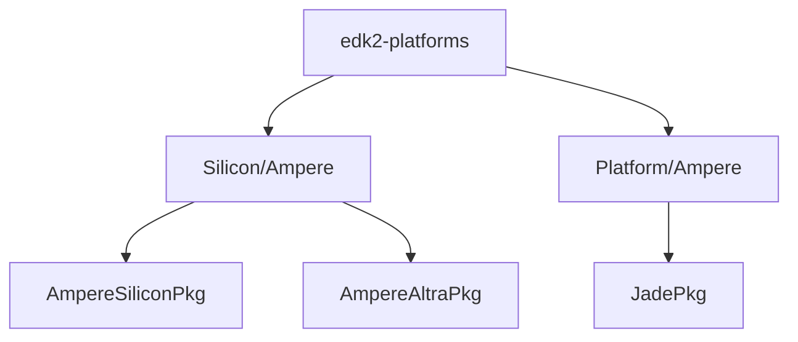

# Ampere Altra Based Platforms Porting Guide

## Overview

The purpose of this document is to describe changes commonly made when adding a
new Ampere Altra based platform.

Users of this document should have prior firmware development experience with
EDKII, including knowledge of UEFI specification.

This document also assumes your new platform meets Ampere(R) Altra(R) Interface
Firmware Requirements and is working with the Ampere system firmware and Trusted Firmware-A (TF-A).

---

## EDKII Code Organization

The following diagram is the hierarchical structure of the silicon and platform
directory. It is designed for easy portability and cross-platform reuse between
Ampere Altra based platforms.



All the packages are currently located under Silicon/Ampere and Platform/Ampere
directories.

The following table describes the intention of the above package organization:

Directory Name    | Description
------------------|-------------------------------------------------------------
AmpereSiliconPkg  | Ampere silicon common code that can be shared for multiple silicon.
AmpereAltraPkg    | Ampere Altra specific code.
JadePkg           | Ampere Mt. Jade Platform code. Any new platform/board should be based on this package.

---

## Porting TianoCore EDKII to a new platform

This section describes the common process of adding a new platform based on the Mt.
Jade reference platform. First, construct a minimal EDK2 that can boot to UEFI Shell.
Then, enable features one-by-one such as PCIe, ACPI, SMBIOS, etc.

1. Create a vendor directory and a board directory with the pattern: `edk2-platforms/Platform/<Your Company Name>/<New Board>Pkg`.
   For the sake of simplicity, the new platform will be under `Platform/Ampere/NewBoardPkg`.
2. Copy `Platform/Ampere/JadePkg` to `Platform/Ampere/NewBoardPkg`.
3. Rename the file name under the `NewBoardPkg` like BoardSetting.cfg and DSC/FDF file to match the platform name.

### DSC/FDF

Replace correspondingly the `Jade`/`JADE` with `NewBoard`/`NEWBOARD` throughout the files.

### Board Setting

The Board Setting is a collection of board and hardware configurations for an Altra-based ARM64 platform.

Modify it appropriately for the new platform configuration.

Please refer to the Ampere Altra Interface Firmware Requirements at the Table 4 for detailed descriptions of each Board Setting fields.

### PCIe Root Complex Configuration

Below modules are generic and can be shared among Ampere Altra-based platforms.

Module Name                                            | Description
-------------------------------------------------------|---------------------------------------------------------------------------------
Platform/Ampere/JadePkg/Drivers/AcpiPlatformDxe        | Patch DSDT and install MCFG, IORT tables
Platform/Ampere/JadePkg/Drivers/PciPlatformDxe         | Install PCI platform protocol for post-initialization phase
Silicon/Ampere/AmpereAltraPkg/Drivers/PcieInitPei      | Install Root Complex Shared HOB consumed by other modules
Silicon/Ampere/AmpereAltraPkg/Library/Ac01PcieLib      | Core library including basic function to initialize the PCIe Root Complex
Silicon/Ampere/AmpereAltraBinPkg/Library/PciePhyLib    | Provide functions to initialize the PCIe PHY
Silicon/Ampere/AmpereAltraPkg/Library/PciHostbridgeLib | Provide functions to build and free the array of Root Bridge resource
Silicon/Ampere/AmpereAltraPkg/Library/PciSegmentLib    | Provide functions to access the PCIe Configuration space

The difference between platforms could be the mechanism to control the PERST line
for each PCIe controller and the segment number. Platform code must modify the functions
below in the Platform/Ampere/JadePkg/Library/BoardPcieLib/BoardPcieLib.c to comply
with specific platform hardware.

This `BoardPcieAssertPesrt()` function controls the toggling of PERST to release reset to endpoint card.
The Mt. Jade platform uses a combination of GPIO pins to assert PERST to endpoint card.

**BoardPcieAssertPerst**

  ```c
  /**
    Assert PERST of the PCIe controller

    @param[in]  RootComplex           Root Complex instance.
    @param[in]  PcieIndex             PCIe controller index of input Root Complex.
    @param[in]  IsPullToHigh          Target status for the PERST.

    @retval RETURN_SUCCESS            The operation is successful.
    @retval Others                    An error occurred.
  **/
  RETURN_STATUS
  EFIAPI
  BoardPcieAssertPerst (
    IN AC01_ROOT_COMPLEX *RootComplex,
    IN UINT8             PcieIndex,
    IN BOOLEAN           IsPullToHigh
    );
  ```

This `BoardPcieGetSegmentNumber()` defines the segment number mapping of PCIe root complexes.
See the content in the inline function for more information about PCIe segment mapping in Ampere Mt. Jade platform.

**BoardPcieGetSegmentNumber**

  ```c
  /**
    Override the segment number for a root complex with a board specific number.

    @param[in]  RootComplex           Root Complex instance with properties.

    @retval Segment number corresponding to the input root complex.
            Default segment number is 0x0F.
  **/
  UINT16
  BoardPcieGetSegmentNumber (
    IN  AC01_ROOT_COMPLEX *RootComplex
    );
  ```
Note: Although the PCIe segment number mapping could be changed but it is not recommended
unless the custom board has to use a different mapping. If using different mapping,
along with the change in `BoardPcieGetSegmentNumber()`, the PCIe segment number must be
also updated in ACPI DSDT and MCFG tables.

### PCIe Hot-Plug

`Silicon/Ampere/AmpereAltraPkg/Library/PcieHotPlugLib` is the base library that
supports the function calls to start PCIe Hot-Plug service including the SPCI callings
to ATF to set hot-plug port map, and GPIO or I2C for PCIe reset. There are two functions
in this library that a custom board can use to change the hot-plug configuration
if it is different from Mt. Jade platform: `PcieHotPlugSetPortMap()` and
`PcieHotplugSetGpioMap()`. By default, the configuration of Ampere Mt. Jade 2U platform
will be set. In case the new board uses a different configuration, user can override
the default PCDs used by these two functions with the custom configuration in `NewBoard.dsc`.

**PcieHotplugSetPortMap()**

Function `PcieHotplugSetPortMap()` passes hot-plug configuration to Trusted Firmware-A (TF-A)
to update/customize port map entries such as I2C address, RCA port, RCA sub-port, etc.
It uses SPCI PORTMAP_SET_CMD to send that information to ATF.
Refer to the document titled Altra ATF Interface Specification for more details on this function.

A custom platform that does not use the same Hot-Plug PortMap configuration with
Ampere Mt. Jade 2U platform must define the corresponding PCD below.

```c
#
# Flag to indicate option of using default or specific platform Port Map table
#   Set TRUE: if using the default setting in Ampere Mt. Jade 2U platform.
#   Set FALSE: if using a custom PCIe Hot-Plug Port Map settings.
#
gAmpereTokenSpaceGuid.PcdPcieHotPlugPortMapTable.UseDefaultConfig|TRUE

#
# Setting Portmap table
#
# * Elements of array:
#   - 0: Index of Portmap entry in Portmap table structure (Vport).
#   - 1: Socket number (Socket).
#   - 2: Root complex port for each Portmap entry (RcaPort).
#   - 3: Root complex sub-port for each Portmap entry (RcaSubPort).
#   - 4: Select output port of IO expander (PinPort).
#   - 5: I2C address of IO expander that CPLD backplane simulates (I2cAddress).
#   - 6: Address of I2C switch between CPU and CPLD backplane (MuxAddress).
#   - 7: Channel of I2C switch (MuxChannel).
#   - 8: It is set from PcieHotPlugSetGpioMap () function to select GPIO[16:21] (PcdPcieHotPlugGpioResetMap) or I2C for PCIe reset purpose.
#   - 9: Segment of root complex (Segment).
#   - 10: SSD slot index on the front panel of backplane (DriveIndex).
#
# * Caution:
#   - The last array ({ 0xFF, 0, 0, 0, 0, 0, 0, 0, 0, 0, 0xFF }) require if no fully structured used.
#   - Size of Portmap table: PortMap[MAX_PORTMAP_ENTRY][sizeof(PCIE_HOTPLUG_PORTMAP_ENTRY)] <=> PortMap[96][11].
# * Example: Bellow configuration is an example for Portmap table of Mt. Jade 2U platform.
#
gAmpereTokenSpaceGuid.PcdPcieHotPlugPortMapTable.PortMap[0]|{ 0, 0, 2, 0, 0, 0x00, 0x00, 0x0, 0, 1, 0xFF } # S0 RCA2.0
gAmpereTokenSpaceGuid.PcdPcieHotPlugPortMapTable.PortMap[1]|{ 1, 0, 3, 0, 1, 0x00, 0x00, 0x0, 0, 0, 0xFF } # S0 RCA3.0
gAmpereTokenSpaceGuid.PcdPcieHotPlugPortMapTable.PortMap[2]|{ 2, 0, 4, 0, 2, 0x27, 0x70, 0x1, 0, 2, 6 } # S0 RCB0.0 - SSD6
gAmpereTokenSpaceGuid.PcdPcieHotPlugPortMapTable.PortMap[3]|{ 3, 0, 4, 2, 3, 0x27, 0x70, 0x1, 0, 2, 7 } # S0 RCB0.2 - SSD7
gAmpereTokenSpaceGuid.PcdPcieHotPlugPortMapTable.PortMap[4]|{ 4, 0, 4, 4, 0, 0x25, 0x70, 0x1, 0, 2, 2 } # S0 RCB0.4 - SSD2
gAmpereTokenSpaceGuid.PcdPcieHotPlugPortMapTable.PortMap[5]|{ 5, 0, 4, 6, 1, 0x25, 0x70, 0x1, 0, 2, 3 } # S0 RCB0.6 - SSD3
gAmpereTokenSpaceGuid.PcdPcieHotPlugPortMapTable.PortMap[6]|{ 6, 0, 5, 0, 0, 0x24, 0x70, 0x1, 0, 3, 0 } # S0 RCB1.0 - SSD0
gAmpereTokenSpaceGuid.PcdPcieHotPlugPortMapTable.PortMap[7]|{ 7, 0, 5, 2, 1, 0x24, 0x70, 0x1, 0, 3, 1 } # S0 RCB1.2 - SSD1
gAmpereTokenSpaceGuid.PcdPcieHotPlugPortMapTable.PortMap[8]|{ 8, 0, 5, 4, 2, 0x26, 0x70, 0x1, 0, 3, 4 } # S0 RCB1.4 - SSD4
gAmpereTokenSpaceGuid.PcdPcieHotPlugPortMapTable.PortMap[9]|{ 9, 0, 5, 6, 3, 0x26, 0x70, 0x1, 0, 3, 5 } # S0 RCB1.6 - SSD5
gAmpereTokenSpaceGuid.PcdPcieHotPlugPortMapTable.PortMap[10]|{ 10, 0, 6, 0, 2, 0x00, 0x00, 0x0, 0, 4, 0xFF } # S0 RCB2.0
gAmpereTokenSpaceGuid.PcdPcieHotPlugPortMapTable.PortMap[11]|{ 11, 0, 6, 2, 3, 0x00, 0x00, 0x0, 0, 4, 0xFF } # S0 RCB2.2
gAmpereTokenSpaceGuid.PcdPcieHotPlugPortMapTable.PortMap[12]|{ 12, 0, 6, 4, 0, 0x00, 0x00, 0x0, 0, 4, 0xFF } # S0 RCB2.4
gAmpereTokenSpaceGuid.PcdPcieHotPlugPortMapTable.PortMap[13]|{ 13, 0, 7, 0, 1, 0x00, 0x00, 0x0, 0, 5, 0xFF } # S0 RCB3.0
gAmpereTokenSpaceGuid.PcdPcieHotPlugPortMapTable.PortMap[14]|{ 14, 0, 7, 4, 2, 0x00, 0x00, 0x0, 0, 5, 0xFF } # S0 RCB3.4
gAmpereTokenSpaceGuid.PcdPcieHotPlugPortMapTable.PortMap[15]|{ 15, 0, 7, 6, 3, 0x00, 0x00, 0x0, 0, 5, 0xFF } # S0 RCB3.6
gAmpereTokenSpaceGuid.PcdPcieHotPlugPortMapTable.PortMap[16]|{ 16, 1, 2, 0, 0, 0x26, 0x70, 0x2, 0, 6, 20 } # S1 RCA2.0 - SSD20
gAmpereTokenSpaceGuid.PcdPcieHotPlugPortMapTable.PortMap[17]|{ 17, 1, 2, 1, 1, 0x26, 0x70, 0x2, 0, 6, 21 } # S1 RCA2.1 - SSD21
gAmpereTokenSpaceGuid.PcdPcieHotPlugPortMapTable.PortMap[18]|{ 18, 1, 2, 2, 2, 0x27, 0x70, 0x2, 0, 6, 22 } # S1 RCA2.2 - SSD22
gAmpereTokenSpaceGuid.PcdPcieHotPlugPortMapTable.PortMap[19]|{ 19, 1, 2, 3, 3, 0x27, 0x70, 0x2, 0, 6, 23 } # S1 RCA2.3 - SSD23
gAmpereTokenSpaceGuid.PcdPcieHotPlugPortMapTable.PortMap[20]|{ 20, 1, 3, 0, 0, 0x00, 0x00, 0x0, 0, 7, 0xFF } # S1 RCA3.0
gAmpereTokenSpaceGuid.PcdPcieHotPlugPortMapTable.PortMap[21]|{ 21, 1, 3, 2, 1, 0x00, 0x00, 0x0, 0, 7, 0xFF } # S1 RCA3.2
gAmpereTokenSpaceGuid.PcdPcieHotPlugPortMapTable.PortMap[22]|{ 22, 1, 4, 0, 0, 0x00, 0x00, 0x0, 0, 8, 0xFF } # S1 RCB0.0
gAmpereTokenSpaceGuid.PcdPcieHotPlugPortMapTable.PortMap[23]|{ 23, 1, 4, 4, 2, 0x25, 0x70, 0x2, 0, 8, 18 } # S1 RCB0.4 - SSD18
gAmpereTokenSpaceGuid.PcdPcieHotPlugPortMapTable.PortMap[24]|{ 24, 1, 4, 6, 3, 0x25, 0x70, 0x2, 0, 8, 19 } # S1 RCB0.6 - SSD19
gAmpereTokenSpaceGuid.PcdPcieHotPlugPortMapTable.PortMap[25]|{ 25, 1, 5, 0, 0, 0x24, 0x70, 0x2, 0, 9, 16 } # S1 RCB1.0 - SSD16
gAmpereTokenSpaceGuid.PcdPcieHotPlugPortMapTable.PortMap[26]|{ 26, 1, 5, 2, 1, 0x24, 0x70, 0x2, 0, 9, 17 } # S1 RCB1.2 - SSD17
gAmpereTokenSpaceGuid.PcdPcieHotPlugPortMapTable.PortMap[27]|{ 27, 1, 5, 4, 2, 0x00, 0x00, 0x0, 0, 9, 0xFF } # S1 RCB1.4
gAmpereTokenSpaceGuid.PcdPcieHotPlugPortMapTable.PortMap[28]|{ 28, 1, 6, 0, 3, 0x25, 0x70, 0x4, 0, 10, 11 } # S1 RCB2.0 - SSD11
gAmpereTokenSpaceGuid.PcdPcieHotPlugPortMapTable.PortMap[29]|{ 29, 1, 6, 2, 2, 0x25, 0x70, 0x4, 0, 10, 10 } # S1 RCB2.2 - SSD10
gAmpereTokenSpaceGuid.PcdPcieHotPlugPortMapTable.PortMap[30]|{ 30, 1, 6, 4, 1, 0x27, 0x70, 0x4, 0, 10, 15 } # S1 RCB2.4 - SSD15
gAmpereTokenSpaceGuid.PcdPcieHotPlugPortMapTable.PortMap[31]|{ 31, 1, 6, 6, 0, 0x27, 0x70, 0x4, 0, 10, 14 } # S1 RCB2.6 - SSD14
gAmpereTokenSpaceGuid.PcdPcieHotPlugPortMapTable.PortMap[32]|{ 32, 1, 7, 0, 3, 0x26, 0x70, 0x4, 0, 11, 13 } # S1 RCB3.0 - SSD13
gAmpereTokenSpaceGuid.PcdPcieHotPlugPortMapTable.PortMap[33]|{ 33, 1, 7, 2, 2, 0x26, 0x70, 0x4, 0, 11, 12 } # S1 RCB3.2 - SSD12
gAmpereTokenSpaceGuid.PcdPcieHotPlugPortMapTable.PortMap[34]|{ 34, 1, 7, 4, 1, 0x24, 0x70, 0x4, 0, 11, 9 } # S1 RCB3.4 - SSD9
gAmpereTokenSpaceGuid.PcdPcieHotPlugPortMapTable.PortMap[35]|{ 35, 1, 7, 6, 0, 0x24, 0x70, 0x4, 0, 11, 8 } # S1 RCB3.6 - SSD8
gAmpereTokenSpaceGuid.PcdPcieHotPlugPortMapTable.PortMap[36]|{ 0xFF, 0, 0, 0, 0, 0, 0, 0, 0, 0, 0xFF } # Require if no fully structure used
```

**PcieHotplugSetGpioMap()**

Function `PcieHotplugSetGpioMap()` is used to limit the number of GPIO[16:21] pins or
use I2C instead of GPIO for PCIe reset. It uses SPCI GPIOMAP_CMD to send information to ATF.
Ampere EDK2 defines `gPcieHotPlugGpioResetMap` PCD to allow user to define a custom GPIO Map.
In `NewBoard.dsc`, user should set the new PCD indicating the GPIO Map for PCIe Hot-Plug.
Below is the GPIO Reset Map PCD definition for Ampere Mt. Jade platform.

```c
gAmpereTokenSpaceGuid.PcdPcieHotPlugGpioResetMap|0x3F
```

### ACPI

The ACPI tables are split into two main parts: common ACPI tables and platform specific ACPI tables.
The common tables are under AmpereAltraPkg so that they can be reused by different platforms.

In order to modify the platform specific tables under `Platform/Ampere/NewBoardPkg/AcpiTables`,
update correspondingly with the following points:

* DSDT/GED1 Device (Shutdown Button)
  * The interrupt number, which is currently set to 327.
* DSDT/I2C4 Device (IPMI SSIF)
  * The values of the SSCN (Standard Mode) and FMCN (Fast Mode) based on the new platform's frequency calibration.
  * The BMC slave address in the I2cSerialBusV2 () function, which is currently set to 0x0010.
* DSDT/UART Devices
  * There are three UART devices that can be used by EDK2:
    * UART0 for ACPI SPCR table (CPU main console)
    * UART2 for ACPI DBG2 table
    * UART3: non-use
  * Add or remove UART devices based on the platform configuration.
* DSDT/MHPP for Memory Hot-Plug Port Mapping
  * This is a shared DRAM memory region between ATF and UEFI to indicate a PCIe hot-plug event action.
    An item of this MHPP region is used to reflect a hot-plug event action of each PCIe port.
    Whenever there is a PCIe hot-plug event, ATF will update the action value to each item of MHPP region,
    and UEFI will handle the hot-plug ejection/insertion accordingly
  * An item of MHPP is 24-bytes in size and is named by a 4-character word (mnemonic) to represent a PCIe Root Port device.
    The name format is <root_complex_A/B><socket><root_complex_number><root_complex_port>.
    For example, if the board has a PCIe Root Port device RCA2.0 on socket 1 the hot-plug event action item must be named A120.
  * This MHPP region is declared in the file named `Platform/Ampere/JadePkg/AcpiTable/MHPP.asi`.
    For Altra Max, this ACPI table is located at `Platform/Ampere/JadePkg/Ac02AcpiTables/MHPP.asi`.
    If the new board has the list of PCIe devices different than the Ampere Mt. Jade board, these items in MHPP region must be renamed.
* DSDT/PCI for Hot-Plug events
  * The files to declare the PCIe Root Port are `Platform/Ampere/JadePkg/AcpiTables/{PCI-S0.asi, PCI-S1.asi}`.
    Note that the ACPI tables for Altra Max based platform is at `Platform/Ampere/JadePkg/Ac02AcpiTables/` folder.
    To support full hot-plug feature (software and hardware hot-plug with LED behavior functioning),
    the Segment:Bus:Device.Function (S:B:D.F) of the Root Port must be declared correctly. Follow the steps listed below to declare them.
    * List down PCIe devices tree in Linux using lspci -tv command to see all Root Port S:B:D.F values.
    * Find out which PCIe device includes the segment that the Root Port has.
    * Based on this S:B:D.F, declare Root Port device into the PCIe Device just found.
    * Add _STA and _EJ0 instance to handle insertion and ejection events.

### SMBIOS

Two key modules are responsible for producing SMBIOS tables: **SmbiosPlatformDxe** and **OemMiscLib**. These modules are essential for
defining the platform-specific information derived from hardware characteristics of your platform.

You need to update these modules SmbiosPlatformDxe and OemMiscLib to reflect your platform's hardware.

Most of fields in SMBIOS Type 1, 2, and 3 are fetched from FRU Device via the IPMI SSIF interface.
If the new platform does not support the IPMI SSIF, please drop the support, especially the `IpmiFruInfo.c` file.

### RTC

On Ampere Mt. Jade, the hardware RTC connects to I2C6 on the master socket and validated with PCF85063AT chip.
The GPI4 is dedicated for obtaining exclusive access because the RTC is shared between BMC and the SoC.

If you use the same RTC hardware on the new platform, modify appropriately the following macros for the I2C and GPI:

* GPI
  * `I2C_RTC_ACCESS_GPIO_PIN`: RTC Access Lock
* I2C
  * `I2C_RTC_BUS_ADDRESS`: I2C bus
  * `I2C_RTC_BUS_SPEED`: I2C bus speed
  * `I2C_RTC_CHIP_ADDRESS`: I2C slave address of the RTC

If you use a different RTC on the new platform, you will need to port to the new hardware RTC chip.

You can also leverage `EmbeddedPkg/Library/VirtualRealTimeClockLib/VirtualRealTimeClockLib.inf` if the hardware RTC has not supported yet.

### IPMI/SSIF

The IPMI SSIF is used for the communication between the BMC and the SoC. It requires the following platform-specific modules:

* `Silicon/Ampere/AmpereAltraPkg/Drivers/SmbusHc/SmbusHcDxe.inf`: This driver produces the SMBUS protocol at DXE phase.
* `Silicon/Ampere/AmpereAltraPkg/Drivers/SmbusHc/SmbusHcPei.inf`: This driver produces the SMBUS protocol at PEI phase.
* `Platform/Ampere/NewBoardPkg/Library/PlatformBmcReadyLib/PlatformBmcReadyLib.inf`:
  This platform-dependent library provides API to check BMC status before executing SMBus commands for IPMI communication.
  On the Mt. Jade platform, the Altra SoC relies on GPI0 (referred to as BMC_READY GPIO) to determine status of BMC is ready for the IPMI communication.
  If the custom platform does not support this pin, use a NULL library that assumes BMC is always on and ready to accept IPMI messages. Put below line to NewBoard.dsc.

  ```c
  Features/ManageabilityPkg/Library/PlatformBmcReadyLibNull/PlatformBmcReadyLibNull.inf
  ```

In order to enable the IPMI SSIF support:

1. Ensure that the I2C4 is connected to the BMC and the frequency is operated at 400KHz.
2. Update correspondingly the following PCDs if there are different configuration
   from the BMC slave address and the BMC_READY GPIO if the custom board uses BMC_READY GPIO to determine the status of BMC.
   * `gAmpereTokenSpaceGuid.PcdBmcReadyGpio`

### Signed Capsule Update

There are two types of the firmware image supported on the Ampere Mt. Jade platform:

* The combination of Ampere Trusted Firmware-A (TF-A) FIP, Board Settings, and EDK2 FD.
* Ampere System Firmware (SCP Firmware)

In order to enable the capsule update feature, update the IMAGE_ID and IMAGE_ID_STRING
to match the platform name in the `Platform/Ampere/NewBoardPkg/Capsule/SystemFirmwareDescriptor/SystemFirmwareDescriptor.aslc` file.

Please refer to
[Capsule Based Firmware Update and Firmware Recovery](https://github.com/tianocore/tianocore.github.io/wiki/Capsule-Based-Firmware-Update-and-Firmware-Recovery)
for detailed porting instructions.

### Trusted Platform Module (TPM)

No change is needed.

It's important that the ATF running on the new platform must comply with the Ampere Altra Interface Firmware Requirements.

### Secure Boot and Update
No change is needed. The new platform can inherit the required libraries and modules to support this feature.

Ampere EDK2 supports UEFI Secure Boot and it complies with UEFI Specifications.
User can change the UEFI secure boot keys using UEFI Menu Setup.

If the DBB/DBU secure keys are deployed, requires to boot and update EDK2 firmware via capsule using the signed firmware image.

Users can run firmware update at run-time OS without reboot using
[amp_fwupgrade](https://github.com/AmpereComputing/amp-fwupgrade) utility to update signed ATF-UEFI EDK2 image and signed SCP image.

---

## Contact Information

If you have the patches and want to share with Ampere, use git-send-mail to Ampere EDK2 maintainers/reviewers
* Nhi Pham <nhi@os.amperecomputing.com>
* Chuong Tran <chuong@os.amperecomputing.com>
* Rebecca Cran <rebecca@os.amperecomputing.com>

For any technical questions that you want to consult with, send email to Ampere Support support@amperecomputing.com.
