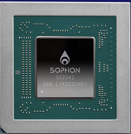
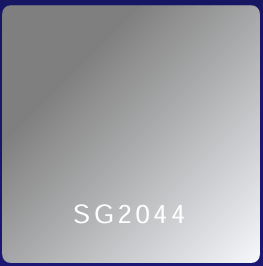
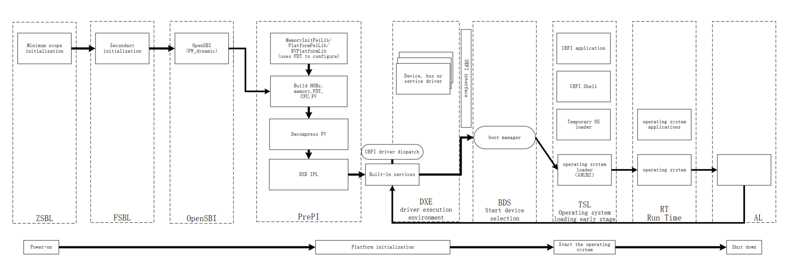

# Sophgo EDK2 RISC-V Platform Project

## Sophgo Product Series

### 1. SG2042

A Server SOC (System-on-Chip) integrates 64 high performance RISC-V cores with 64MB system cache. RISC-V clock runs at 2GHz.

| RISC-V Cores | Frequency | System Cache | Connectivity   | DDR           | Other              |
| ------------ | --------- | ------------ | -------------- | ------------- | ------------------ |
| 64           | 2GHz      | 64MB         | 32X PCIe Gen 4 | 256 bits DDR4 | RVV0.7, SV39, CCIX |

### 2. SG2044

Second-generation RISC-V server-grade processor.

| RISC-V Cores | Frequency | DDR              | Connectivity   | Other                           |
| ------------ | --------- | ---------------- | -------------- | ------------------------------- |
| 64           | 2.6GHz    | 512 bits LPDDR5X | 40X PCIe Gen 5 | RVV1.0, SV48, SOPHON TPU, Codec |

## Sophgo Platform

EDK2 has been adapted according to different hardware platforms and is mainly divided into SG2044 series and SG2042 series.Completed EDK2 adaptation according to different hardware platforms.

SG2044 Series

* SG2044 EVB

SG2042 Series

* SG2042 X8 EVB
* SG2042 X4 EVB

## SG20XX series EDK2 RISC-V Design and the Boot Processes

The SG20XX RISC-V EDK2 project is developed based on the original Sophgo SG20XX project.SG20XX series RISC-V EDK2 is designed and optimized based on the EDK2 startup phase. The startup process can be roughly divided into the following stages: **ZSBL+FSBL+OpenSBI+EDK2+GRUB2+OS** .
The design diagram and start-up process are shown in the figure below.

**SG20XX series RISC-V EDK2 startup flowchart**

**ZSBL Phase**

ZSBL is the first stage of chip initialization, Code provided by Sophgo.the main work is to initialize DDR.

**FSBL Phase**

**Note:** The FSBL here corresponds to the ZSBL stage code provided by Sophgo.
The ZSBL stage works for the following:

1. Initialize the serial port of the ZSBL stage for DEBUG.
2. Establish a memory mapping table for initializing and configuring the memory management of the operating system or firmware.
3. Initialization of some CPU functions.

**OpenSBI Phase**

OpenSBI provides the conditions for platform initialization of SG20XX, which runs as an independent firmware and an environment of an initialization link before edk2, which exists in the form of FW_PAYLOAD, which initializes the system in M-mode and initializes some functions of SG20XX , and put the subsequent edk2 operating environment in S-mode.

**PrePI Phase**

The PrePI phase builds some HOBs on Memory, CPU, FV, Stack and processor smbios information, eventually loading the DXE Core and transferring control.

**DXE Phase**

EDK2 DXE OpenSBI protocol provides the unified interface for all DXE drivers to invoke SBI services，the DXE stage mainly adds the SG20XX SD card reading driver to read the contents of the SD card.

**BDS Phase**

The BDS stage runs under S-mode,The implementation of the RISC-V edk2 port in the BDS stage is executed with the PcdDxeCorePrivilegeMode PCD configuration permission, because OpenSBI converts the mode to S-mode, when BDS hands over the power to the operating system, it must be S-mode, avoiding another mode switch.

**TSL Phase**

The work at this stage is mainly to use edk2 Shell to boot and start the GRUB2 program code in the SD card, and use GRUB to load different OS operating systems in the partition.

**RT Phase**

No work done.

**AL Phase**

No work done.
